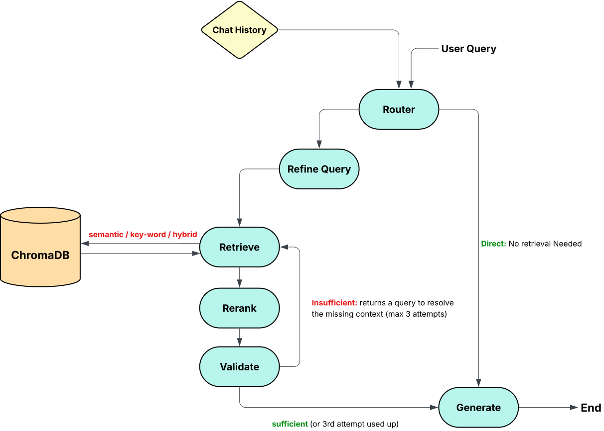

# OmniResearch — Backend Documentation

AI-powered research and document analysis platform. This document covers the **backend only** (FastAPI + Supabase + ChromaDB + LangGraph). Frontend documentation lives separately.

## Table of Contents

- [Overview](#overview)
- [Tech Stack](#tech-stack)
- [Project Structure](#project-structure)
- [Environment Variables](#environment-variables)
- [Running the Backend](#running-the-backend)
- [Database Schema](#database-schema)
- [Authentication & Roles](#authentication--roles)
- [API Reference](#api-reference)
- [The Agentic RAG System](#the-agentic-rag-system)
- [Retrieval Modes: Semantic, Keyword, Hybrid](#retrieval-modes-semantic-keyword-hybrid)
- [Reranking](#reranking)
- [LLM Provider Fallback (Gemini → Mistral)](#llm-provider-fallback-gemini--mistral)
- [Daily Token Quota](#daily-token-quota)
- [Document & URL Ingestion Pipeline](#document--url-ingestion-pipeline)
- [Usage Monitoring](#usage-monitoring)
- [Row Level Security](#row-level-security)
- [Testing](#testing)

---

## Overview

Users register (admin-approved), create **projects** (workspaces), and inside each project:
- have one or more **chats** with an LLM (Gemini, falling back to Mistral),
- attach **collections** of sources — text files, PDFs, or URLs — which are chunked, embedded, and stored in ChromaDB,
- toggle which sources are active as context,
- pick a **retrieval mode** (semantic / keyword / hybrid) per message,
- get answers grounded in those sources via an **agentic RAG graph** (LangGraph) that decides for itself whether retrieval is even needed, retrieves a wide candidate pool, reranks it with a cross-encoder, and retries with a targeted follow-up query if the first pass isn't enough.

A three-tier role hierarchy (`user` / `admin` / `superadmin`) governs an admin dashboard covering user approval, role management, per-user daily token quotas, login activity, and per-user LLM/search usage monitoring.

---

## Tech Stack

| Concern | Technology |
|---|---|
| API framework | FastAPI |
| Relational data | Supabase (PostgreSQL), accessed via the **service role** key only |
| Vector storage | ChromaDB (local, persistent) |
| Embeddings | `embeddinggemma` via local Ollama |
| Reranking | `BAAI/bge-reranker-base` cross-encoder via `sentence-transformers`/`torch`, GPU (CUDA/MPS) or CPU |
| Keyword search | BM25 sparse vectors via ChromaDB's local `ChromaBm25EmbeddingFunction`, scored manually (see [Retrieval Modes](#retrieval-modes-semantic-keyword-hybrid)) |
| Primary LLM | Gemini (`google-genai` SDK — **not** the legacy `google-generativeai`) |
| Fallback LLM | Mistral, called via raw `requests` (no `mistralai` SDK, to avoid dependency conflicts) |
| Agentic RAG orchestration | LangGraph |
| Web search | Tavily, Exa |
| Web fetch (single URL) | Jina Reader |
| Auth | Argon2 password hashing + JWT (python-jose) |
| PDF text extraction | pypdf |
| Testing | `pytest`, `fastapi.testclient.TestClient`, `unittest.mock` |

---

## Project Structure

```
backend/
├── main.py                      # FastAPI app, CORS, router registration, lifespan (embedding + reranker warmup)
├── config/
│   ├── settings.py              # pydantic-settings; all env vars
│   ├── auth.py                  # Argon2 + JWT helpers, get_current_user / require_admin / require_superadmin
│   ├── env.py                   # legacy manual dotenv loader (still referenced by settings.py)
│   ├── models.py                # get_gemini_response() — Gemini call + Mistral fallback + usage logging
│   └── prompts.py               # every RAG prompt template, centralized
├── database/
│   ├── db.py                    # Supabase client singleton (service role key)
│   └── chroma_client.py         # ChromaDB client + per-collection chunk add/delete (embeds BM25 vectors at add time)
├── models/                      # Pydantic request/response schemas, split by domain
│   ├── auth.py  user.py  log.py  chat.py  collection.py  project.py  search.py
├── routes/                      # FastAPI routers, split by domain
│   ├── auth.py                  # register, login
│   ├── projects.py              # project CRUD
│   ├── search.py                # web search endpoint
│   ├── admin/                   # package — see below
│   ├── chat/                    # package — see below
│   └── collections/             # package — see below
├── services/                    # business logic used by routes and graph nodes
│   ├── extraction.py            # txt/pdf → raw text
│   ├── text_processing.py       # chunk_text()
│   ├── embeddings.py            # embed_texts(), warm_up_embedding_model()
│   ├── reranker.py              # cross-encoder rerank(), warm_up_reranker()
│   ├── bm25.py                  # BM25 sparse vector helpers (compute, serialize, sparse dot product)
│   ├── web_fetch.py             # Jina Reader (manual URL add)
│   ├── web_search.py            # Tavily / Exa search, normalized result shape
│   ├── rag_llm.py               # router/refine/validate/generate prompts → get_gemini_response
│   ├── rag_retrieval.py         # active-item lookup + semantic/keyword/hybrid chunk pool retrieval
│   ├── quota.py                 # daily token quota check/enforcement
│   └── usage_tracker.py         # best-effort LLM token / search credit logging
├── graph/                       # LangGraph agentic RAG pipeline
│   ├── state.py                 # RAGState TypedDict
│   ├── graph.py                 # builds + compiles the graph, conditional edges
│   └── nodes/
│       ├── router_node.py  refine_query_node.py  retrieve_node.py  rerank_node.py
│       └── validation_node.py  generate_node.py
├── scripts/
│   └── backfill_bm25.py         # one-off: adds BM25 vectors to chunks stored before that feature existed
└── tests/                       # pytest suite — see Testing
```

**`routes/admin/`** (prefix `/admin`, tags `Administration`):
```
admin/
├── __init__.py    # aggregates the sub-routers below into one APIRouter
├── users.py       # list, approve, change_role, delete
├── quota.py       # change_token_limit
├── logs.py        # login activity
├── stats.py       # overview aggregate counts
└── usage.py       # per-user LLM/search usage aggregation
```

**`routes/chat/`** (tags `Chats`):
```
chat/
├── __init__.py    # aggregates the sub-routers below
├── _shared.py     # _verify_project_owner, _own_chat — shared ownership checks
├── crud.py        # list/create/rename/delete chats
├── messages.py    # message history retrieval
└── send.py        # /message and /message/stream — invokes the RAG graph
```

**`routes/collections/`** (tags `Collections`):
```
collections/
├── __init__.py    # aggregates the sub-routers below
├── _shared.py     # _verify_project_owner, _own_collection, _existing_urls
├── crud.py        # list/create/delete collections
├── items.py       # list/toggle/bulk-toggle/delete items
└── ingest.py       # file upload, manual URL add, from-search bulk add — plus their background task processors
```

Each package's `__init__.py` creates the actual prefixed `APIRouter` and calls `include_router()` on every sub-router; every sub-router itself is a bare `APIRouter()` with no prefix of its own. `backend/routes/__init__.py` imports `router` from each package exactly the same way it would from a plain module (`from backend.routes.admin import router as admin_router`), so nothing about how these are wired into `main.py` differs from a single-file router.

---

## Environment Variables

All read via `backend/config/settings.py` (most sourced from `backend/config/env.py`, a couple defined directly on the `Settings` class with plain defaults).

```env
# Supabase
SUPABASE_URL=https://xxx.supabase.co
SUPABASE_SERVICE_KEY=eyJ...          # must be the service_role key, NOT anon — see "Row Level Security"

# JWT
JWT_SECRET=<32+ random hex chars>
JWT_ALGORITHM=HS256
JWT_EXPIRE_MINUTES=60

# CORS
CORS_ORIGINS=http://localhost:8501,http://127.0.0.1:8501

# Gemini (primary LLM)
GEMINI_API_KEY=...
GEMINI_MODEL=gemini-2.5-flash

# Mistral (fallback LLM — used automatically if Gemini fails, e.g. quota exhaustion)
MISTRAL_API_KEY=...
MISTRAL_MODEL=mistral-small-2506
FORCE_MISTRAL=false                  # set true to force Mistral-only, for testing the fallback path

# Chat history
UI_HISTORY_LIMIT=50                  # messages shown in the UI
LLM_CONTEXT_LIMIT=10                 # messages sent to the LLM as context

# Embeddings (local Ollama)
EMBEDDING_MODEL=embeddinggemma
CHUNK_SIZE=1000
CHUNK_OVERLAP=150

# Reranker (BAAI/bge-reranker-base cross-encoder)
# Model name/pool-size/top-k are plain defaults on the Settings class, not
# meant to be overridden via .env. HF_HOME/HF_HUB_OFFLINE below control
# where the model is cached and whether it's allowed to hit the network.
HF_HOME=./rerankers
HF_HUB_OFFLINE=1

# ChromaDB
CHROMA_PERSIST_DIR=./vector_database

# Web search / fetch
JINA_API_KEY=...
TAVILY_API_KEY=...
EXA_API_KEY=...
```

**Ollama** must be running locally with `embeddinggemma` pulled (`ollama pull embeddinggemma`) before starting the backend — `warm_up_embedding_model()` runs at startup and logs a warning (not a crash) if Ollama isn't reachable yet.

**Reranker model**: `HF_HOME`/`HF_HUB_OFFLINE` are read directly by `transformers`/`huggingface_hub` from the process environment — they're not routed through `Settings` at all, since those libraries already know how to find them on their own. `backend/config/env.py` calls `load_dotenv()` at import time, before `backend/services/reranker.py` is ever imported, so anything set in `.env` is already in `os.environ` by the time the reranker's imports run.

**Import order in `main.py`**: the reranker (`torch`/`sentence-transformers`) is imported *before* the route modules, which pull in the Gemini SDK (`google-genai`) and its native dependencies (`grpc`/`protobuf`). Importing the Gemini SDK's native deps before torch causes a native DLL collision on Windows (`0xC0000005` access violation, no Python traceback). Loading torch first avoids it — a comment in `main.py` documents this explicitly so the import blocks aren't reordered without re-testing.

---

## Running the Backend

```bash
pip install -r requirements.txt --break-system-packages   # if needed
uvicorn backend.main:app --reload --port 8000
```

`GET /health` returns service status and the resolved CORS origin list — useful as a first smoke test.

---

## Database Schema

All tables live in Supabase/Postgres, under `public`. RLS is enabled on every table (see [Row Level Security](#row-level-security)) — the backend bypasses it entirely via the service role key.

| Table | Purpose | Key columns |
|---|---|---|
| `users` | Custom auth table (not Supabase Auth) | `id, username, password (Argon2id), role ('user'\|'admin'\|'superadmin'), is_approved, daily_token_limit` |
| `login_logs` | Login activity, shown in admin dashboard | `user_id, username, login_time, ip_address` |
| `projects` | Workspaces, one user owns many | `id, user_id, name` |
| `chats` | Conversations inside a project | `id, project_id, name` |
| `messages` | Persisted chat history | `id, chat_id, role ('user'\|'assistant'), content` |
| `collections` | Source groupings inside a project | `id, project_id, name, type ('documents'\|'urls'\|'text')` |
| `collection_items` | One row per file/URL inside a collection | `id, collection_id, name, source_type ('txt'\|'pdf'\|'url'), is_active, status ('processing'\|'ready'\|'error'), chunk_count, error_message` |
| `llm_usage` | One row per LLM call, for admin monitoring and daily quota enforcement | `user_id, provider ('gemini'\|'mistral'), model, prompt_tokens, completion_tokens, total_tokens, created_at` |
| `search_usage` | One row per web search call, for admin monitoring | `user_id, engine ('tavily'\|'exa'), num_results, search_depth, credits` |

**Notes:**
- `users.role` has a `CHECK` constraint restricting it to `'user'`, `'admin'`, `'superadmin'`.
- `users.daily_token_limit` defaults to `80000`; editable per-user by an admin/superadmin (never for another admin/superadmin's own account — see [Daily Token Quota](#daily-token-quota)).
- `collections.type` determines what `collection_items` can be added: `text` → `.txt` uploads, `documents` → `.pdf` uploads, `urls` → manual URL add or web-search results. Uploads for `urls` collections are rejected at the API level.
- `collection_items.is_active` controls whether that item's chunks are included in RAG retrieval — toggled from the UI, applied via a bulk PATCH endpoint (batches many toggles into one request rather than one request per checkbox).
- `collection_items.status` starts at `"processing"` the instant a row is inserted (file upload, URL add, or search-result add) and flips to `"ready"`/`"error"` once its background task finishes — see [Document & URL Ingestion Pipeline](#document--url-ingestion-pipeline).
- `search_usage.credits`: Tavily's `advanced` search depth costs ~2x a normal call, so it's logged as 2 credits; everything else (other Tavily depths, all Exa calls) is 1 credit.
- `llm_usage.created_at` is also what daily quota enforcement sums against (`total_tokens` since UTC midnight for a given `user_id`) — no separate quota-tracking table exists.
- ChromaDB mirrors `collections`: one Chroma collection per Supabase `collections.id`. Each chunk inside it is tagged with `item_id` in its metadata (plus `bm25_indices`/`bm25_values`, JSON-serialized sparse vector fields used by keyword/hybrid retrieval), so toggling/deleting a single file or URL never requires touching other items' chunks.

---

## Authentication & Roles

1. Register → `is_approved = false`, `role = 'user'`.
2. Admin/superadmin approves via `PUT /admin/users/{id}/approve`.
3. Login → JWT issued, payload `{"sub": "<user_uuid>", "username": ..., "role": ..., "exp": ...}`. Note `sub` is the UUID, not the username.
4. Every authenticated request sends `Authorization: Bearer <token>`.
5. `get_current_user` dependency decodes the JWT into `{sub, username, role}`.
6. Passwords are hashed with Argon2id (`argon2-cffi`), not bcrypt — bcrypt raises on passwords over 72 bytes, Argon2 has no such limit.

**Role hierarchy** (`backend/config/auth.py`): both `require_admin` and `require_superadmin` are built from one factory, `_require_role(*allowed_roles, message)`, which decodes the token and checks membership:

```python
require_admin = _require_role("admin", "superadmin", message="Admin access required.")
require_superadmin = _require_role("superadmin", message="Super admin access required.")
```

- **`user`** — no admin access.
- **`admin`** — can approve/delete regular user accounts and edit their daily token limits, and can see login logs/stats/usage scoped to regular users only. Cannot see other admins, the superadmin, or themselves in any of those views. Cannot promote, demote, or delete another admin.
- **`superadmin`** — sees every account except their own (both `user` and `admin` rows), can promote/demote between `user` and `admin` (`require_superadmin`-gated), can delete `user` or `admin` accounts (never another superadmin, never themselves), and can edit the daily token limit for `user`-role accounts only (not for admins, since token quotas don't apply to admin accounts). A `superadmin`'s own role can never be changed or deleted through the API.

This scoping is enforced at the route level in `routes/admin/*.py` — each handler filters query results by the requester's role and excludes the requester's own `user_id`, rather than relying on the frontend to hide anything.

---

## API Reference

All routes are prefixed at the app root except `/admin/*`, which has its own router prefix.

### Auth
| Method | Path | Notes |
|---|---|---|
| POST | `/auth/register` | Creates an unapproved user |
| POST | `/auth/login` | Returns JWT + user info |

### Admin (requires `role in ("admin", "superadmin")` unless noted)
| Method | Path | Notes |
|---|---|---|
| GET | `/admin/users` | `?pending_only=true` to filter; results scoped by requester's role (see [Authentication & Roles](#authentication--roles)) |
| PUT | `/admin/users/{id}/approve` | |
| PUT | `/admin/users/{id}/role` | **`require_superadmin` only.** `?new_role=admin\|user`; can't change your own role or a superadmin's role |
| PUT | `/admin/users/{id}/token-limit` | Target must be `role == "user"` |
| DELETE | `/admin/users/{id}` | Can't delete your own account or a superadmin; a plain admin can only delete `user`-role accounts |
| GET | `/admin/logs` | Paginated login history, `?username=` filter, scoped by role |
| GET | `/admin/stats` | Aggregate counts + 7 most recent logins, scoped by role; superadmin responses include an `admin_users` count |
| GET | `/admin/usage/llm` | Per-user token usage, aggregated in Python from `llm_usage` |
| GET | `/admin/usage/search` | Per-user search credits, aggregated in Python from `search_usage` |

### Projects
| Method | Path |
|---|---|
| GET / POST | `/projects` |
| PUT / DELETE | `/projects/{project_id}` |

### Chats
| Method | Path | Notes |
|---|---|---|
| GET / POST | `/projects/{project_id}/chats` | |
| PUT / DELETE | `/chats/{chat_id}` | |
| GET | `/chats/{chat_id}/messages` | Last `UI_HISTORY_LIMIT` messages, oldest first |
| POST | `/chats/{chat_id}/message` | Non-streaming — runs the full RAG graph, returns the final answer. Body includes `retrieval_mode` (`"semantic"` default). Enforces the daily token quota before doing anything else |
| POST | `/chats/{chat_id}/message/stream` | SSE — emits `{"type":"node","node":...}` per graph step, then `{"type":"done","answer":...}` or `{"type":"error","detail":...,"code":...}`. A `quota_exceeded` error carries structured `used`/`limit`/`reset_at` fields alongside the message |

### Collections
| Method | Path | Notes |
|---|---|---|
| GET / POST | `/projects/{project_id}/collections` | |
| DELETE | `/collections/{collection_id}` | Also deletes its ChromaDB collection |
| GET | `/collections/{collection_id}/items` | |
| POST | `/collections/{collection_id}/items` | Multipart file upload (txt/pdf collections only). Returns immediately with `status="processing"` rows; extraction/chunk/embed run as a background task |
| POST | `/collections/{collection_id}/items/url` | Manual single URL add (urls collections only). Returns immediately; Jina fetch + chunk/embed run as a background task |
| POST | `/collections/{collection_id}/items/from-search` | Bulk-add selected Tavily/Exa results; rejects URLs already in the collection. Returns immediately; chunk/embed per item runs as a background task (no re-fetch — uses the search engine's snippet) |
| PATCH | `/collections/{collection_id}/items/{item_id}` | Toggle `is_active` |
| PATCH | `/collections/{collection_id}/items/bulk` | Batch toggle many items in one request |
| DELETE | `/collections/{collection_id}/items/{item_id}` | Deletes the Supabase row and its Chroma chunks |

### Search
| Method | Path | Notes |
|---|---|---|
| POST | `/search/web` | `{engine: "tavily"\|"exa", query, num_results, search_depth}` — logs usage automatically |

---

## The Agentic RAG System

Built with LangGraph. Given a user query, the recent chat history, and a chosen retrieval mode, the graph decides for itself whether it needs to search the project's sources at all. If it does, it retrieves a wide candidate pool, reranks it down to the best few chunks, and — if that still isn't enough — retries with a validator-generated follow-up query targeting specifically what's missing, up to a bounded number of attempts, before answering regardless.



### Flow

1. **`router`** (`decide_retrieval`) — one LLM call decides `RETRIEVE` or `DIRECT`. `DIRECT` for greetings, small talk, or anything answerable from the visible chat history alone. `RETRIEVE` for anything needing facts from the project's sources, or an explicit "search my documents" request.
2. **`DIRECT`** → skips straight to `generate`.
3. **`RETRIEVE`** → **`refine_query`** — rewrites the raw message into a standalone search query using history to resolve references (e.g. "what is it?" → "what is an LLM?").
4. **`retrieve`** (`retrieve_pool`, `backend/services/rag_retrieval.py`) — fetches a wide candidate pool (`retrieval_pool_size`, default 50) for the current round's query, using whichever retrieval mode (semantic/keyword/hybrid) the request specified. The first round searches for the refined query; a retry round searches for the validator's `missing_query` instead — a deliberately different, more targeted query, not more results from the same original search.
5. **`rerank`** (`rerank_node`) — re-scores that round's pool against the same query with the `BAAI/bge-reranker-base` cross-encoder, keeps the top `rerank_top_k` (default 5), and merges them into whatever context chunks were already accepted from earlier rounds — deduplicated by `(collection_id, item_id, content)` so the same chunk never counts twice.
6. **`validate`** (`validate_context`) — one LLM call judges whether the accumulated `context_chunks` can answer the *original* query (not the retry query). Returns `SUFFICIENT`, or `INSUFFICIENT: <follow-up query>` describing exactly what's still missing. Skipped (auto-pass) only on a truly empty first attempt with no sources at all — if a later retry's pool comes back empty but earlier rounds already found something, validation still runs normally against what's been accumulated so far.
7. **Conditional**: `SUFFICIENT` → `generate`. `INSUFFICIENT` and `retrieval_attempts < MAX_RETRIEVAL_ATTEMPTS` (3) → back to `retrieve`, now targeting the missing-info query. Attempts exhausted → `generate` anyway, with whatever context exists — the system always answers rather than refusing outright.
8. **`generate`** (`generate_answer`) — if retrieval was needed but zero context chunks were ever found (no active sources in the project, or all toggled off), returns a fixed message telling the user to add/activate sources, without calling the LLM at all. Otherwise, the retrieved context + question are folded into one final "user" turn appended after the real chat history (so role alternation stays valid for Gemini), then sent to `get_gemini_response`.

### State (`backend/graph/state.py`)

```python
class _RAGStateRequired(TypedDict):
    project_id: str
    chat_id: str
    user_id: str              # for usage attribution
    query: str                # original message
    history: list[dict]       # prior messages, excludes the new query
    retrieval_mode: str       # "semantic" | "keyword" | "hybrid"

class RAGState(_RAGStateRequired, total=False):
    refined_query: str
    missing_query: str        # validator's "what's missing" follow-up query, set on a retry
    needs_retrieval: bool
    retrieved_pool: list[dict]
    context_chunks: list[dict]
    retrieval_attempts: int
    validation_passed: bool
    answer: str
```

Split deliberately into required vs. optional fields — the required set is always provided by `backend/routes/chat/send.py` when the graph is invoked, so nodes can safely do `state["query"]` instead of `state.get("query")` for those fields.

### Prompts

All four prompt templates live in `backend/config/prompts.py`: `ROUTER_PROMPT`, `REFINE_QUERY_PROMPT`, `VALIDATION_PROMPT`, `GENERATION_PROMPT`. Router prompt forces a single-word response (`RETRIEVE`/`DIRECT`). Validation prompt forces either the single word `SUFFICIENT`, or `INSUFFICIENT: <query>` — parsed by splitting on the first colon only, so a colon inside the missing-info text itself doesn't get cut off; falls back to the original query if the model doesn't follow the expected format.

### Debugging

Every node prints a `[RAG] ...` line to the backend terminal as it runs (which node, pool size, rerank counts, validation result, etc). The streaming endpoint (`/chats/{id}/message/stream`) surfaces the same node-by-node progress to the frontend in real time via Server-Sent Events, using `graph.stream(..., stream_mode="updates")` instead of `.invoke()`.

---

## Retrieval Modes: Semantic, Keyword, Hybrid

`backend/services/rag_retrieval.py`'s `retrieve_pool(project_id, query, pool_size, mode)` dispatches to one of three strategies:

- **`semantic`** (default) — the original dense-vector approach: embeds the query once via `embeddinggemma`, queries every ChromaDB collection with at least one active item in the project, merges results across collections, sorts globally by distance, keeps the top `pool_size`.
- **`keyword`** — BM25 lexical scoring. Chroma ships a local BM25 sparse-embedding function (`ChromaBm25EmbeddingFunction`, `backend/services/bm25.py`) that runs entirely offline via `snowballstemmer` — no Chroma Cloud dependency. What *is* Chroma-Cloud-only is the managed ranking/fusion layer on top of it (`Search()`/`Knn()`/`Rrf()`); since this project runs a local, self-hosted `PersistentClient`, that layer isn't available. Instead, every active chunk in the project is fetched via a plain `collection.get()` (not a vector search), and scored against the query's BM25 sparse vector via a manual sparse dot product (`sparse_dot`). Chunks with zero shared terms are filtered out entirely rather than ranked last.
- **`hybrid`** — Reciprocal Rank Fusion (RRF) of the semantic and keyword rankings, each pulling a wider candidate pool (`pool_size * 2`) than the final result needs. `RRF_K = 60`, matching Chroma's own default constant for the same fusion strategy. Each ranking contributes `1/(RRF_K + rank + 1)` per chunk; a chunk found by both rankings scores higher than one found by only one.

**BM25 vectors are computed at ingestion time**, not query time, and stored as two JSON-string fields on each chunk's Chroma metadata (`bm25_indices`, `bm25_values` — `backend/services/bm25.py`'s `sparse_vector_to_metadata`/`sparse_vector_from_metadata`), since Chroma metadata values must be `str`/`int`/`float`/`bool`, not lists. `backend/database/chroma_client.py`'s `add_item_chunks` computes and attaches these alongside the dense embedding for every new chunk. Chunks added before this feature existed have no `bm25_*` fields — `backend/scripts/backfill_bm25.py` is a one-off, safe-to-rerun script that backfills them for every existing chunk across every collection.

All three modes return chunks in the same shape (`content`, `source_name`, `collection_id`, `item_id`, `distance`), with `distance` normalized so "lower = more relevant" holds regardless of which mode produced it — semantic keeps Chroma's raw distance, keyword/hybrid negate their score so higher relevance still sorts first.

---

## Reranking

`backend/services/reranker.py` wraps `BAAI/bge-reranker-base` as a `sentence-transformers` `CrossEncoder`.

- `warm_up_reranker()` runs in `main.py`'s lifespan (alongside `warm_up_embedding_model()`), selecting a device via `_select_device()` (`cuda` → `mps` → `cpu`, in that order of preference) and running one dummy `.predict()` call to force the weights onto that device before the first real request arrives.
- `rerank(query, chunks, top_k)` builds `(query, chunk_content)` pairs, scores them all in one `model.predict()` call, and returns the `top_k` highest-scoring chunks with a `rerank_score` field attached.
- If warm-up hasn't run yet (e.g. a script importing this module directly rather than through the FastAPI app), `_get_model()` lazily calls `warm_up_reranker()` on first use instead of failing.

---

## LLM Provider Fallback (Gemini → Mistral)

`backend/config/models.py`'s `get_gemini_response(messages, temperature, user_id)` is the single entry point every LLM call in the app goes through (router, refine, validate, generate).

1. Tries Gemini first.
2. On **any** exception (most commonly hitting the free-tier quota), logs it and transparently retries via Mistral — a direct `requests.post` to `https://api.mistral.ai/v1/chat/completions`, deliberately **not** the `mistralai` SDK, to avoid dependency conflicts.
3. Mistral's chat completions API is OpenAI-compatible, and messages already use `"user"`/`"assistant"` roles, so no role conversion is needed there (unlike Gemini, which needs `"user"`/`"model"`).
4. If Mistral also fails, raises `RuntimeError("The base model quota has been reached. Please try again later.")` — a clean, user-facing message. The full technical detail from both providers is still printed to the backend logs immediately before this raise, so nothing is lost for debugging even though the user only sees the clean version. This reaches the frontend as a `502` on the non-streaming endpoint, or an SSE `error` event on the streaming one.
5. Set `FORCE_MISTRAL=true` to skip Gemini entirely — useful for testing the fallback path without waiting for a real quota error.

Both providers' token usage is captured and logged per-call (see [Usage Monitoring](#usage-monitoring)) — this same `llm_usage` log is also what daily quota enforcement reads from.

---

## Daily Token Quota

`backend/services/quota.py` enforces a per-user daily LLM token limit, reusing the existing `llm_usage` table rather than a separate tracking mechanism.

- **`get_tokens_used_today(user_id)`** sums `total_tokens` from `llm_usage` for that user since UTC midnight.
- **`get_daily_token_limit(user_id)`** reads `users.daily_token_limit` (admin/superadmin-editable), falling back to `DEFAULT_DAILY_TOKEN_LIMIT = 80_000` if the row or column value is missing.
- **`enforce_daily_quota(user_id)`** raises `DailyQuotaExceeded` if `used >= limit`. Both `/chats/{id}/message` and `/chats/{id}/message/stream` call this as the very first thing — before the user's message is persisted or the RAG graph is touched at all, so an exhausted user never spends further tokens on router/refine/validate calls before being blocked.
- **`DailyQuotaExceeded`**'s message states exactly when the quota resets (`reset_at`, always UTC midnight of the next day — no per-user timezone is stored, so the reset time is explicitly labeled UTC rather than implying local time) and how much time remains. The exception also carries `used`, `limit`, and `reset_at` as attributes, which both endpoints surface as structured fields (not just prose) in their error responses, alongside a `code: "quota_exceeded"` marker.

---

## Document & URL Ingestion Pipeline

Every ingestion entry point (file upload, manual URL add, from-search bulk add) follows the same pattern: insert the `collection_items` row with `status="processing"` and return the response immediately, then do the actual extraction/chunk/embed work as a **FastAPI `BackgroundTasks`** callback, updating the row to `"ready"`/`"error"` once it finishes. None of these block the HTTP response — Starlette runs a sync background task in its threadpool after the response is already sent.

For `text`/`documents` collections (`POST /collections/{id}/items`, background task `_process_upload_item` in `routes/collections/ingest.py`):

1. Validate file extension matches the collection type.
2. Extract raw text (`extraction.py`: `extract_txt` decodes UTF-8/latin-1; `extract_pdf` uses pypdf page-by-page).
3. Chunk (`text_processing.py`: simple overlapping character-based chunker, `chunk_size`/`chunk_overlap` from settings).
4. Embed all chunks in one batch via `embeddings.py` (`embed_texts`, calls local Ollama).
5. Store in the collection's ChromaDB collection via `add_item_chunks` — `documents` = raw chunk text, `embeddings` = vectors, `metadatas` = `{item_id, collection_id, source_name, chunk_index, bm25_indices, bm25_values}`.
6. Update the `collection_items` row: `status = "ready"`, `chunk_count = len(chunks)` — or `status = "error"` with `error_message` if anything above failed.

For `urls` collections, two entry points instead of upload, each with its own background processor:
- **Manual add** (`POST /collections/{id}/items/url`, `_process_url_item`): fetches the page as markdown via Jina Reader, then follows the same chunk → embed → store pipeline. Rejects duplicate URLs within the same collection.
- **From search** (`POST /collections/{id}/items/from-search`, `_process_search_result_item`): the Tavily/Exa snippet/highlight text is embedded directly, with no re-fetch — a deliberate speed/cost tradeoff over always pulling the full page.

---

## Usage Monitoring

- **LLM tokens**: every `get_gemini_response` call logs one `llm_usage` row (provider, model, prompt/completion/total tokens), attributed to the user via `RAGState.user_id`. Gemini's `usage_metadata.{prompt,candidates,total}_token_count` and Mistral's OpenAI-compatible `usage.{prompt,completion,total}_tokens` are both captured. This same table backs daily quota enforcement (see above).
- **Search credits**: every `/search/web` call logs one `search_usage` row, weighted 2 credits for Tavily `advanced` depth, 1 credit otherwise.
- Both loggers are **best-effort** — wrapped in `try/except`, printing on failure rather than raising, so a logging hiccup can never break an actual chat response or search.
- `GET /admin/usage/llm` and `GET /admin/usage/search` aggregate raw rows into per-user totals in Python (not a SQL view/RPC), and both are scoped by the requester's role the same way `/admin/users`/`/admin/logs`/`/admin/stats` are.

---

## Row Level Security

RLS is enabled on all 9 tables. This is safe because the backend's only Supabase client (`backend/database/db.py`) uses the **service role** key, which has `BYPASSRLS` in Postgres — it ignores RLS regardless of whether it's enabled or whether any policies exist.

**Critical gotcha**: if login (or any other DB-backed endpoint) suddenly starts failing with empty results right after enabling RLS, the near-certain cause is that `SUPABASE_SERVICE_KEY` in `.env` is actually the **anon** key, not the true `service_role` key — Supabase's dashboard lists both, and it's an easy copy-paste mix-up. Decode the JWT payload to check:

```bash
echo "$SUPABASE_SERVICE_KEY" | cut -d. -f2 | base64 -d | python3 -m json.tool
```

`"role": "service_role"` is correct; `"role": "anon"` is the bug.

---

## Testing

`backend/tests/` is a `pytest` suite of 327 test functions across 21 files, split between pure unit tests (services, graph nodes, config, model validation) and route-level integration tests (via `fastapi.testclient.TestClient` against a fully in-memory fake database and RAG graph).

**Configuration** (`backend/Pytest.ini`):
```ini
[pytest]
testpaths = tests
python_files = test_*.py
python_classes = Test*
python_functions = test_*
addopts = -v --tb=short
```

**`conftest.py`** does three things before any test runs:

1. **Sets fake env vars** (`SUPABASE_URL`, `JWT_SECRET`, `GEMINI_API_KEY`, etc.) so `Settings()` can construct without real credentials.
2. **Stubs out heavy/native modules entirely** via `sys.modules.setdefault(name, MagicMock())` — `chromadb`, `google.genai`, `supabase`, `ollama`, `exa_py`, `tavily`, `torch` (and its `cuda`/`backends`/`backends.mps` submodules), `sentence_transformers`. This means the test suite never actually loads ChromaDB, torch, or any real ML dependency — imports of those libraries resolve to mocks immediately.
3. **Provides fixtures** for the two testing styles used throughout the suite:

   - **`app` fixture** — yields `(TestClient, FakeDB)`. Patches `get_supabase` in *every* route/service module that imported it directly (`_patch_all_get_supabase`, since `from x import get_supabase` binds a local reference that patching the source module alone wouldn't reach), replaces `get_gemini_response` with a stub, and replaces the compiled RAG graph (`backend.routes.chat.send.get_rag_graph`) with a configurable `FakeRAGGraph`. Used by every `test_routes_*.py` file for full-stack integration tests that never touch a real network call.
   - **`user_headers` / `admin_headers` / `superadmin_headers`** — pre-built `Authorization` headers from `make_token()`/`make_admin_token()`/`make_superadmin_token()`, JWTs signed with the real `create_access_token()` against the test's fake `JWT_SECRET`.
   - **`FakeDB`** — a stand-in for the Supabase client. `.add_result(data=..., count=...)` queues a `FakeResult`; `.table(name)` pops the next queued result off a FIFO queue regardless of which table/filters were actually requested, via `FakeQuery`, whose `__getattr__` makes every chained method (`.select()`, `.eq()`, `.order()`, etc.) a no-op that returns itself until `.execute()` is called.
   - **`FakeRAGGraph`** — stands in for the compiled LangGraph pipeline; `.answer` and `.raise_exc` are configurable per test to control what `/message` and `/message/stream` return.
   - Row-builder helpers (`project_row`, `collection_row`, `chat_row`, `message_row`, `user_row`) build minimally-valid dict rows matching each table's shape, so individual tests don't repeat that boilerplate.

**Unit test files** (no `app` fixture, no HTTP layer — call functions directly with `monkeypatch`):

| File | Covers |
|---|---|
| `test_auth_utils.py` | Password hashing/verification (Argon2), JWT encode/decode, `require_admin`/`require_superadmin` role gating |
| `test_config_models.py` | `get_gemini_response`'s Gemini→Mistral fallback chain, `FORCE_MISTRAL`, the combined-failure error message |
| `test_graph_nodes.py` | Every graph node individually — router, refine_query, retrieve (query precedence, attempt counting, empty-pool handling), rerank (merge/dedup logic), validation, generate (no-sources short-circuit) |
| `test_models.py` | Every Pydantic model's validators (username/password rules, collection type checks, retrieval_mode literal, token-limit bounds, etc.) |
| `test_services_bm25.py` | Sparse vector computation, metadata serialization round-trip, sparse dot product scoring |
| `test_services_extraction.py` | `extract_txt` encoding fallback, `extract_pdf` page-joining behavior |
| `test_services_quota.py` | Daily limit lookup/fallback, tokens-used summation, `enforce_daily_quota`'s boundary conditions, `DailyQuotaExceeded`'s message formatting |
| `test_services_rag_llm.py` | History/context formatting, router/refine/validate/generate prompt-driven parsing (including the `INSUFFICIENT: <query>` split logic) |
| `test_services_rag_retrieval.py` | All three retrieval strategies individually, plus the mode dispatcher |
| `test_services_reranker.py` | Score-based sorting/truncation, lazy warm-up-on-first-use, chunk-field preservation without mutating input |
| `test_services_text_processing.py` | Chunking boundary behavior (overlap, exact-size input, whitespace, full coverage with no gaps) |
| `test_services_usage_tracker.py` | LLM/search usage row insertion, credit weighting, best-effort error swallowing |

**Integration test files** (use the `app` fixture — real FastAPI routing, real Pydantic validation, real JWT auth, fake DB/graph underneath):

| File | Covers |
|---|---|
| `test_health_and_settings.py` | `/health`, and `Settings` parsing (CORS list, JWT/Chroma/reranker defaults) |
| `test_routes_auth.py` | Register/login success and every validation/rejection path |
| `test_routes_projects.py` | Project CRUD and ownership checks |
| `test_routes_chats.py` | Chat CRUD, message history, `/message` (including exact RAG-graph state construction), quota enforcement (429 on exceeded, pass-through under limit) |
| `test_routes_collections.py` | Collection CRUD and ownership/type validation |
| `test_routes_search.py` | Search success/failure, validation, usage recording (and non-recording on failure) |
| `test_routes_admin.py` | User listing/approval/role-change/deletion across the full role hierarchy (admin vs. superadmin visibility and permissions), logs, stats |
| `test_routes_admin_quota.py` | Token-limit update endpoint validation and permission checks |
| `test_routes_admin_usage.py` | LLM/search usage aggregation endpoints |